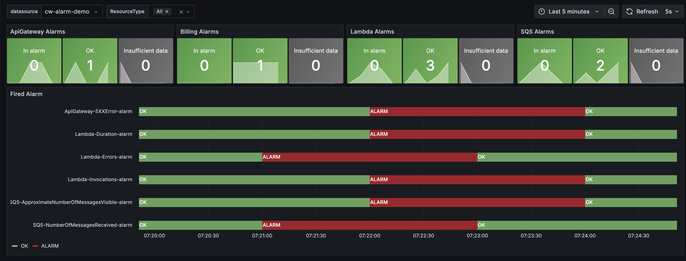

# AWS CloudWatch Alarms

## Overview

A comprehensive AWS observability solution that centralizes all CloudWatch alarms in Grafana. This project provides:
- Automated forwarding of CloudWatch alarms to Grafana
- A unified dashboard for monitoring alarms across all AWS services
- Customizable alerting rules and notification channels
- Real-time visibility into your AWS infrastructure health
- Multi-channel notifications through:
  - Email alerts with detailed HTML formatting
  - Slack integration for team collaboration
  - Google Chat integration for workspace communication

### Visual Overview



## Deployment
### Installation Steps

1. Ensure you have AWS credentials configured:
   ```bash
   aws configure
   ```

2. Configure your variables in `terraform.auto.tfvars`:
   ```hcl
   aws_region = "us-east-1"
   grafana_url = "https://your-grafana-instance"
   grafana_access_token = "your-grafana-token"
   rotation_period_days = 30
   
   # Notification channels (optional)
   grafana_contact_point_email = "your-email@example.com"  # For email notifications
   grafana_contact_point_slack_url = "https://hooks.slack.com/services/..."  # For Slack notifications
   grafana_contact_point_googlechat_url = "https://chat.googleapis.com/v1/spaces/..."  # For Google Chat notifications
   ```

3. Deploy the infrastructure:
   ```bash
   terraform init
   terraform plan
   terraform apply
   ```

### Notification Channels

The project supports multiple notification channels through Grafana:

1. **Email Notifications**
   - Configure your email address in `terraform.auto.tfvars`
   - Alerts will be sent to the specified email address
   - Supports HTML formatting and includes detailed alert information

2. **Slack Integration**
   - Configure your Slack webhook URL in `terraform.auto.tfvars`
   - Alerts will be posted to the specified Slack channel
   - Includes alert details, severity, and links to the Grafana dashboard

3. **Google Chat Integration**
   - Configure your Google Chat webhook URL in `terraform.auto.tfvars`
   - Alerts will be posted to the specified Google Chat space
   - Includes alert details and links to the Grafana dashboard

To set up these integrations:
1. For Slack: Create a new webhook in your Slack workspace and copy the webhook URL
2. For Google Chat: Create a new webhook in your Google Chat space and copy the webhook URL
3. For Email: Simply provide your email address

### Demo
```bash
python source-alarm-demo/demo_alerting_cloud_watch.py
```

## Additional Resources

- [AWS CloudWatch Documentation](https://docs.aws.amazon.com/cloudwatch/)
- [Terraform Documentation](https://www.terraform.io/docs/index.html)
- [Grafana Documentation](https://grafana.com/docs/)

## License

This project is licensed under the MIT License - see the [LICENSE](../LICENSE) file for details.

<!-- BEGIN_TF_DOCS -->
## Requirements

| Name | Version |
|------|---------|
| <a name="requirement_terraform"></a> [terraform](#requirement\_terraform) | >= 1.0.11 |
| <a name="requirement_aws"></a> [aws](#requirement\_aws) | >= 4.59.0 |
| <a name="requirement_grafana"></a> [grafana](#requirement\_grafana) | ~> 3.22.0 |
| <a name="requirement_template"></a> [template](#requirement\_template) | ~> 2 |

## Modules

| Name | Source | Version |
|------|--------|---------|
| <a name="module_lambda_alarm_forwarder"></a> [lambda\_alarm\_forwarder](#module\_lambda\_alarm\_forwarder) | git::https://github.com/terraform-aws-modules/terraform-aws-lambda.git | v6.4.0 |

## Resources

| Name | Type |
|------|------|
| [aws_cloudwatch_event_rule.scrapping_rule](https://registry.terraform.io/providers/hashicorp/aws/latest/docs/resources/cloudwatch_event_rule) | resource |
| [aws_cloudwatch_event_target.lambda_target](https://registry.terraform.io/providers/hashicorp/aws/latest/docs/resources/cloudwatch_event_target) | resource |
| [aws_iam_access_key.access_key](https://registry.terraform.io/providers/hashicorp/aws/latest/docs/resources/iam_access_key) | resource |
| [aws_iam_user.grafana](https://registry.terraform.io/providers/hashicorp/aws/latest/docs/resources/iam_user) | resource |
| [aws_iam_user_policy_attachment.cloudwatch_policy](https://registry.terraform.io/providers/hashicorp/aws/latest/docs/resources/iam_user_policy_attachment) | resource |
| [grafana_contact_point.default](https://registry.terraform.io/providers/grafana/grafana/latest/docs/resources/contact_point) | resource |
| [grafana_dashboard.cloudwatch_alarm](https://registry.terraform.io/providers/grafana/grafana/latest/docs/resources/dashboard) | resource |
| [grafana_data_source.cloudwatch](https://registry.terraform.io/providers/grafana/grafana/latest/docs/resources/data_source) | resource |
| [grafana_folder.rule_folder](https://registry.terraform.io/providers/grafana/grafana/latest/docs/resources/folder) | resource |
| [grafana_notification_policy.default](https://registry.terraform.io/providers/grafana/grafana/latest/docs/resources/notification_policy) | resource |
| [grafana_rule_group.cloudwatch_alarm](https://registry.terraform.io/providers/grafana/grafana/latest/docs/resources/rule_group) | resource |
| [template_file.lambda_policy_alarm_forwarder](https://registry.terraform.io/providers/hashicorp/template/latest/docs/data-sources/file) | data source |

## Inputs

| Name | Description | Type | Default | Required |
|------|-------------|------|---------|:--------:|
| <a name="input_aws_region"></a> [aws\_region](#input\_aws\_region) | The AWS region to deploy the resources in | `string` | `"us-east-1"` | no |
| <a name="input_cloudwatch_namespace"></a> [cloudwatch\_namespace](#input\_cloudwatch\_namespace) | The namespace for the CloudWatch metrics | `string` | `"CloudWatchAlarmsDemo"` | no |
| <a name="input_grafana_access_token"></a> [grafana\_access\_token](#input\_grafana\_access\_token) | The access token for the Grafana instance, can be found in the Grafana UI under the user menu > API keys, can be stored in the terraform.auto.tfvars file, or set as an environment variable, e.g. export TF\_VAR\_grafana\_access\_token=<your\_token> | `string` | n/a | yes |
| <a name="input_grafana_contact_point_email"></a> [grafana\_contact\_point\_email](#input\_grafana\_contact\_point\_email) | The email address for the Grafana contact point | `string` | `""` | no |
| <a name="input_grafana_contact_point_googlechat_url"></a> [grafana\_contact\_point\_googlechat\_url](#input\_grafana\_contact\_point\_googlechat\_url) | The googlechat url for the Grafana contact point | `string` | `""` | no |
| <a name="input_grafana_contact_point_slack_url"></a> [grafana\_contact\_point\_slack\_url](#input\_grafana\_contact\_point\_slack\_url) | The slack url for the Grafana contact point, (String, Sensitive) A Slack webhook URL,for sending messages via the webhook method. | `string` | `""` | no |
| <a name="input_grafana_datasource_name"></a> [grafana\_datasource\_name](#input\_grafana\_datasource\_name) | The name of the Grafana datasource | `string` | `"cw-alarm-demo"` | no |
| <a name="input_grafana_url"></a> [grafana\_url](#input\_grafana\_url) | The URL of the Grafana instance | `string` | n/a | yes |
| <a name="input_grafana_user_name"></a> [grafana\_user\_name](#input\_grafana\_user\_name) | The name of the Grafana user | `string` | `"grafana-cloudwatch-alarm-demo"` | no |
| <a name="input_lambda_runtime"></a> [lambda\_runtime](#input\_lambda\_runtime) | The runtime of the Lambda function (e.g., python3.13) | `string` | `"python3.13"` | no |
| <a name="input_schedule_expression_alarm_forwarder"></a> [schedule\_expression\_alarm\_forwarder](#input\_schedule\_expression\_alarm\_forwarder) | The schedule expression for the CloudWatch event | `string` | `"rate(5 minutes)"` | no |
<!-- END_TF_DOCS -->
