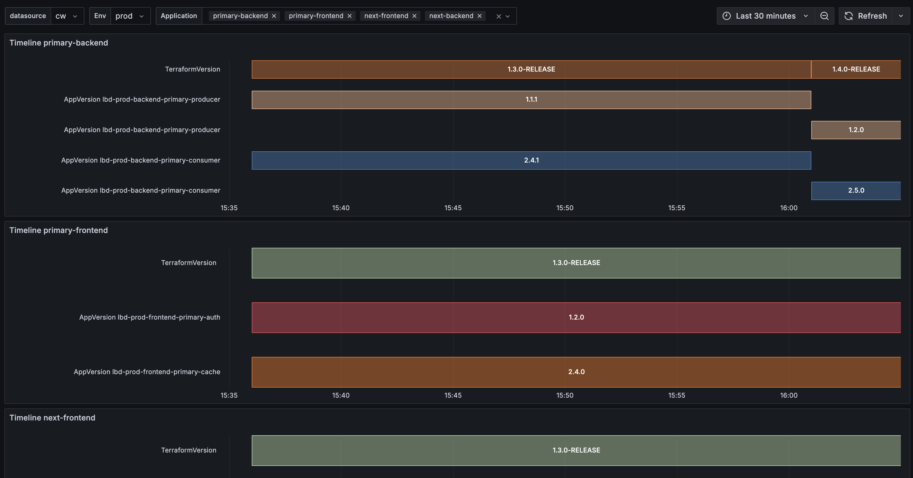

# AWS Lambda Inspector

## Overview

A sophisticated monitoring solution that provides complete visibility into your AWS Lambda functions lifecycle. Key features include:
- Automated tracking of both Infrastructure as Code (IAC) and Application versions
- Comprehensive deployment history and change tracking via AWS Config integration
- Historical version analysis to track version changes over time

### Key Features

- **Automated Version Tracking**: Monitors Lambda function versions across different environments (dev, prod)
- **Historical Analysis**: Tracks version changes over time using AWS Config history
- **Environment Comparison**: Easily compare versions between development and production environments
- **Service-Level Monitoring**: Track versions at the service and stack level
- **CloudWatch Integration**: Publishes custom metrics for better observability
- **Terraform Integration**: Seamlessly works with your existing Terraform infrastructure
- **Grafana Dashboard**: Visual monitoring and alerting capabilities
- **Scheduled Monitoring**: Configurable monitoring intervals (default: 5 minutes)
- **Flexible History Lookback**: Configurable time ranges for historical data analysis

### Visual Overview



## Architecture

The AWS Lambda Inspector consists of the following components:

1. **Inspector Lambda Function**: A Python-based Lambda function that:
   - Lists all Lambda functions in your AWS account
   - Retrieves current tags and version information
   - Queries AWS Config for historical version data
   - Publishes metrics to CloudWatch
   - Runs on a scheduled basis (configurable via `schedule_expression`)

2. **AWS Config Integration**: 
   - Tracks configuration changes over time
   - Provides historical version data for comprehensive analysis
   - Enables tracking of version transitions and rollbacks

3. **CloudWatch Event Rule**: Triggers the Inspector Lambda function at regular intervals

4. **CloudWatch Metrics**: Custom metrics published for monitoring:
   - `lambdaTag`: Function-level metrics with dimensions for environment, service, stack, and version
   - `terraformTag`: Stack-level metrics for Terraform version tracking
   - Historical metrics show version changes over time

5. **Grafana Dashboard**: Provides visual monitoring with:
   - Version comparison across environments
   - Service-level overview
   - Stack-level monitoring
   - Historical version trends

## Deployment
### Installation Steps

1. Ensure you have AWS credentials configured:
   ```bash
   aws configure
   ```

2. Configure your variables in `terraform.auto.tfvars`:
   ```hcl
   aws_region = "us-east-1"
   grafana_url = "https://your-grafana-instance"
   grafana_access_token = "your-grafana-token"
   rotation_period_days = 30
   ```

3. Ensure AWS Config is enabled and recording Lambda functions:
   - Enable AWS Config in your AWS account
   - Configure it to record AWS::Lambda::Function resource types
   - Verify the Lambda Inspector IAM role has Config permissions

4. Deploy the infrastructure:
   ```bash
   terraform init
   terraform plan
   terraform apply
   ```

## Usage

### Command Line Interface

The Lambda Inspector can be run locally for testing and debugging:

```bash
# Run without history (uses current tags only)
python lambda_inspector_function.py False

# Run with history (queries AWS Config for historical data)
python lambda_inspector_function.py True 7 0

# Run with custom time range (7 days lookback, 0 days recent)
python lambda_inspector_function.py True 7 0
```

### Parameters

- `include_history`: Boolean flag to enable/disable AWS Config history queries
- `earlier_days`: Number of days to look back for historical data (default: 365)
- `later_days`: Number of recent days to exclude from history (default: 0)

### AWS Config Requirements

For historical analysis to work properly, ensure:
- AWS Config is enabled in your account
- Lambda functions are being recorded by AWS Config
- The Lambda Inspector has appropriate IAM permissions to query AWS Config

## Monitoring

After deployment, you can monitor your Lambda functions through:

1. **CloudWatch Metrics**:
   - Navigate to CloudWatch > Metrics
   - Look for custom namespace containing `lambdaTag` and `terraformTag` metrics
   - Historical metrics show version changes over time

2. **CloudWatch Logs**:
   - Check the logs of the Inspector Lambda function
   - Monitor for any errors or version mismatches
   - Reduced verbosity for cleaner log output

3. **Grafana Dashboard**:
   - Access the pre-configured dashboard
   - Monitor version differences across environments
   - Set up alerts for version mismatches
   - View historical version trends

## Additional Resources

- [AWS Lambda Documentation](https://docs.aws.amazon.com/lambda/)
- [Terraform Documentation](https://www.terraform.io/docs/index.html)
- [Grafana Documentation](https://grafana.com/docs/)
- [CloudWatch Documentation](https://docs.aws.amazon.com/cloudwatch/)

## License

This project is licensed under the MIT License - see the [LICENSE](../LICENSE) file for details.

<!-- BEGIN_TF_DOCS -->
## Requirements

| Name | Version |
|------|---------|
| <a name="requirement_terraform"></a> [terraform](#requirement\_terraform) | >= 1.0.11 |
| <a name="requirement_aws"></a> [aws](#requirement\_aws) | >= 4.59.0 |
| <a name="requirement_grafana"></a> [grafana](#requirement\_grafana) | ~> 3.22.0 |
| <a name="requirement_template"></a> [template](#requirement\_template) | ~> 2 |

## Modules

| Name | Source | Version |
|------|--------|---------|
| <a name="module_lambda_app_inspector"></a> [lambda\_app\_inspector](#module\_lambda\_app\_inspector) | git::https://github.com/terraform-aws-modules/terraform-aws-lambda.git | v6.4.0 |
| <a name="module_lambda_example"></a> [lambda\_example](#module\_lambda\_example) | git::https://github.com/terraform-aws-modules/terraform-aws-lambda.git | v6.4.0 |

## Resources

| Name | Type |
|------|------|
| [aws_cloudwatch_event_rule.scrapping_rule](https://registry.terraform.io/providers/hashicorp/aws/latest/docs/resources/cloudwatch_event_rule) | resource |
| [aws_cloudwatch_event_target.lambda_target](https://registry.terraform.io/providers/hashicorp/aws/latest/docs/resources/cloudwatch_event_target) | resource |
| [aws_iam_access_key.access_key](https://registry.terraform.io/providers/hashicorp/aws/latest/docs/resources/iam_access_key) | resource |
| [aws_iam_user.grafana](https://registry.terraform.io/providers/hashicorp/aws/latest/docs/resources/iam_user) | resource |
| [aws_iam_user_policy_attachment.cloudwatch_policy](https://registry.terraform.io/providers/hashicorp/aws/latest/docs/resources/iam_user_policy_attachment) | resource |
| [grafana_dashboard.lambda_inspector](https://registry.terraform.io/providers/grafana/grafana/latest/docs/resources/dashboard) | resource |
| [grafana_data_source.cloudwatch](https://registry.terraform.io/providers/grafana/grafana/latest/docs/resources/data_source) | resource |
| [template_file.lambda_policy_app_inspector](https://registry.terraform.io/providers/hashicorp/template/latest/docs/data-sources/file) | data source |

## Inputs

| Name | Description | Type | Default | Required |
|------|-------------|------|---------|:--------:|
| <a name="input_aws_region"></a> [aws\_region](#input\_aws\_region) | The AWS region to deploy the resources in | `string` | `"us-east-1"` | no |
| <a name="input_cloudwatch_namespace"></a> [cloudwatch\_namespace](#input\_cloudwatch\_namespace) | The namespace for the CloudWatch metrics | `string` | `"LambdaInspect"` | no |
| <a name="input_grafana_access_token"></a> [grafana\_access\_token](#input\_grafana\_access\_token) | The access token for the Grafana instance, can be found in the Grafana UI under the user menu > API keys, can be stored in the terraform.auto.tfvars file, or set as an environment variable, e.g. export TF\_VAR\_grafana\_access\_token=<your\_token> | `string` | n/a | yes |
| <a name="input_grafana_datasource_name"></a> [grafana\_datasource\_name](#input\_grafana\_datasource\_name) | The name of the Grafana datasource | `string` | `"cw-demo-lambda-inspector"` | no |
| <a name="input_grafana_url"></a> [grafana\_url](#input\_grafana\_url) | The URL of the Grafana instance | `string` | n/a | yes |
| <a name="input_grafana_user_name"></a> [grafana\_user\_name](#input\_grafana\_user\_name) | The name of the Grafana user | `string` | `"grafana-demo-lambda-inspector"` | no |
| <a name="input_lambda_versions"></a> [lambda\_versions](#input\_lambda\_versions) | Map of environment, service, stack, and lambda function versions | `map(map(map(map(map(string)))))` | <pre>{<br/>  "dev": {<br/>    "primary": {<br/>      "backend": {<br/>        "consumer": {<br/>          "TerraformVersion": "1.4.0-RC5",<br/>          "version": "2.4.1"<br/>        },<br/>        "producer": {<br/>          "TerraformVersion": "1.4.0-RC6",<br/>          "version": "1.1.1"<br/>        }<br/>      },<br/>      "frontend": {<br/>        "auth": {<br/>          "TerraformVersion": "1.4.0-SNAPSHOT",<br/>          "version": "1.2.0"<br/>        },<br/>        "cache": {<br/>          "TerraformVersion": "1.4.0-SNAPSHOT",<br/>          "version": "2.4.0"<br/>        }<br/>      }<br/>    }<br/>  },<br/>  "prod": {<br/>    "next": {<br/>      "backend": {<br/>        "consumer": {<br/>          "TerraformVersion": "1.4.0-RC5",<br/>          "version": "2.4.1"<br/>        },<br/>        "producer": {<br/>          "TerraformVersion": "1.4.0-RC5",<br/>          "version": "1.1.1"<br/>        }<br/>      },<br/>      "frontend": {<br/>        "auth": {<br/>          "TerraformVersion": "1.3.0-RELEASE",<br/>          "version": "1.2.0"<br/>        },<br/>        "cache": {<br/>          "TerraformVersion": "1.3.0-RELEASE",<br/>          "version": "2.4.0"<br/>        }<br/>      }<br/>    },<br/>    "primary": {<br/>      "backend": {<br/>        "consumer": {<br/>          "TerraformVersion": "1.4.0-RELEASE",<br/>          "version": "2.5.0"<br/>        },<br/>        "producer": {<br/>          "TerraformVersion": "1.4.0-RELEASE",<br/>          "version": "1.2.0"<br/>        }<br/>      },<br/>      "frontend": {<br/>        "auth": {<br/>          "TerraformVersion": "1.3.0-RELEASE",<br/>          "version": "1.2.0"<br/>        },<br/>        "cache": {<br/>          "TerraformVersion": "1.3.0-RELEASE",<br/>          "version": "2.4.0"<br/>        }<br/>      }<br/>    }<br/>  }<br/>}</pre> | no |
| <a name="input_schedule_expression_lambda_inspector"></a> [schedule\_expression\_lambda\_inspector](#input\_schedule\_expression\_lambda\_inspector) | The schedule expression for the CloudWatch event | `string` | `"rate(5 minutes)"` | no |
<!-- END_TF_DOCS -->
