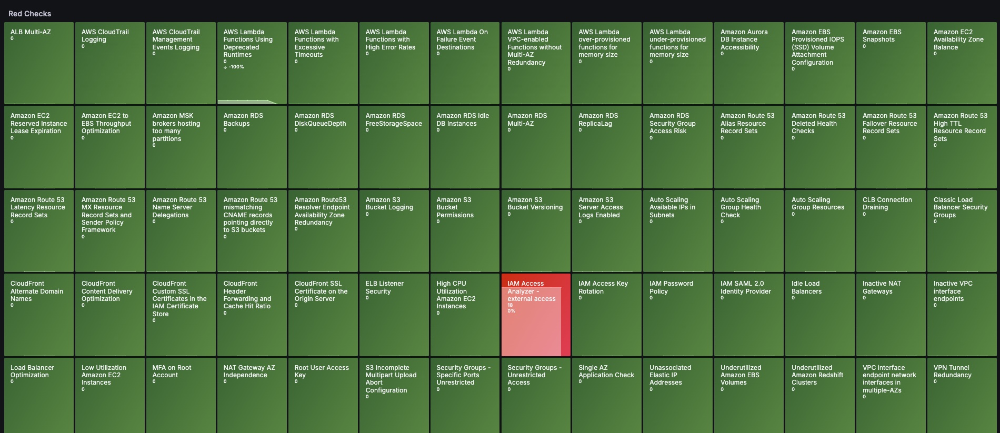
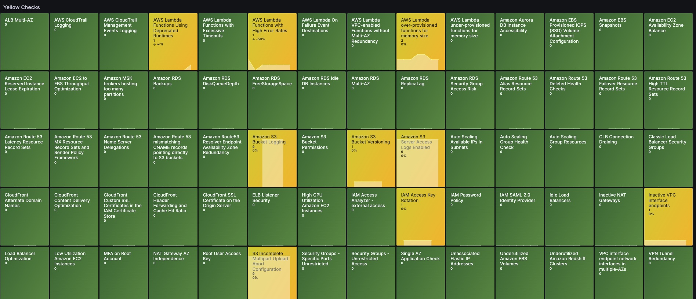

# AWS Trusted Advisor Dashboard
 
### Grafana link

https://grafana.com/grafana/dashboards/23187-aws-trusted-advisor/

### Res checks view

### Yellow checks view

## Overview
This dashboard provides real-time monitoring of AWS Trusted Advisor checks, helping you identify and track potential issues in your AWS infrastructure. It visualizes both critical (Red) and warning (Yellow) issues across various Trusted Advisor categories. The dashboard is specifically configured for the US East (N. Virginia) region (us-east-1).
The dashboard allows you to:
- View check history over different time periods 
- Track the evolution of issues over time
- Monitor the effectiveness of remediation actions
- Identify recurring patterns in resource issues

## Key Features
- Real-time monitoring of Trusted Advisor checks in us-east-1 region
- Color-coded severity indicators:
  - Red: Critical issues requiring immediate attention
  - Yellow: Warning issues that should be monitored
  - Grey: Check not yet performed by AWS
- Historical data visualization
- Two key metrics per check:
  - Number of resources affected by the issue
  - Percentage variation in the number of affected resources
- Automatic refresh of check status
- Customizable time range (default: last 7 days)

## CloudWatch Metrics
The dashboard uses the following AWS CloudWatch metrics from the `AWS/TrustedAdvisor` namespace:
- `RedResources`: Number of resources with critical issues
- `YellowResources`: Number of resources with warning issues

### Links
- [AWS Trusted Advisor Service](https://docs.aws.amazon.com/awssupport/latest/user/trusted-advisor.html)

## Configuration
- **Data Source**: [AWS CloudWatch](https://grafana.com/docs/grafana/latest/datasources/aws-cloudwatch/)
- **Region**: us-east-1 (N. Virginia)

## Tags
- cloudwatch
- Trusted Advisor
- AWS
- Monitoring
- Infrastructure
- us-east-1

## Requirements
- Grafana 12.0.0 or higher
- AWS CloudWatch datasource configured
- Appropriate AWS IAM permissions for Trusted Advisor