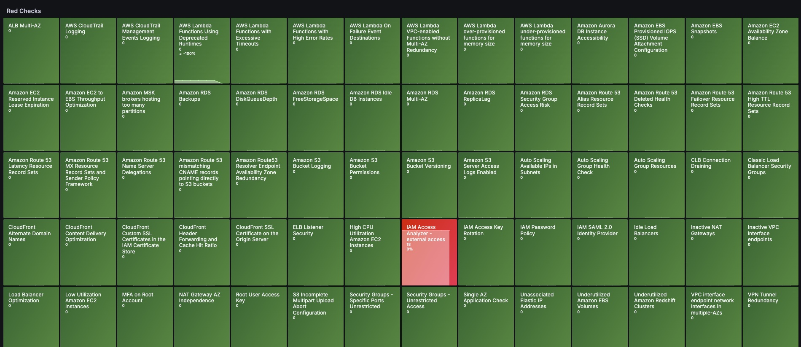
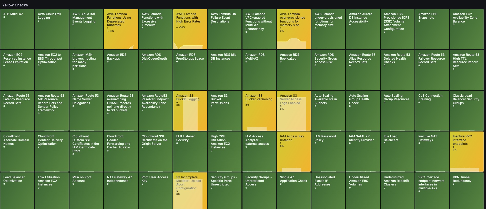

# AWS Trusted Advisor Dashboard

### Grafana link

https://grafana.com/grafana/dashboards/23187-aws-trusted-advisor/

## Prerequisites

### AWS Support Plan Requirements
To use AWS Trusted Advisor, you must have an AWS Support plan. The minimum required plan is the **Developer Support** tier. You can manage your support plan at:
- [AWS Support Plans Console](https://us-east-1.console.aws.amazon.com/support/plans/home?region=us-east-1#/)


## Overview

This dashboard provides real-time monitoring of AWS Trusted Advisor checks, helping you identify and track potential issues in your AWS infrastructure. It visualizes both critical (Red) and warning (Yellow) issues across various Trusted Advisor categories. The dashboard is specifically configured for the US East (N. Virginia) region (us-east-1).

### Key Features

- **Real-time Monitoring**: Track Trusted Advisor checks in us-east-1 region
- **Color-coded Severity**:
  - Red: Critical issues requiring immediate attention
  - Yellow: Warning issues that should be monitored
  - Grey: Check not yet performed by AWS
- **Historical Analysis**: View check history over different time periods
- **Trend Tracking**: Monitor the evolution of issues over time
- **Remediation Monitoring**: Track the effectiveness of remediation actions
- **Pattern Recognition**: Identify recurring patterns in resource issues
- **Automatic Updates**: Real-time refresh of check status
- **Customizable Views**: Adjustable time ranges (default: last 7 days)

### Visual Overview

#### Critical Issues View


#### Warning Issues View


## Architecture

The AWS Trusted Advisor Dashboard consists of the following components:

1. **CloudWatch Metrics**:
   - `RedResources`: Number of resources with critical issues
   - `YellowResources`: Number of resources with warning issues
   - Namespace: `AWS/TrustedAdvisor`

2. **Grafana Integration**:
   - AWS CloudWatch data source
   - Custom dashboard panels
   - Real-time metric updates

## Integration Components

### 1. AWS Trusted Advisor
- **Check Categories**:
  - Cost Optimization
  - Performance
  - Security
  - Fault Tolerance
  - Service Limits
- **Region Support**: us-east-1 (N. Virginia)

### 2. Grafana Dashboard
- **Pre-configured Visualizations**:
  - Critical issues overview
  - Warning issues overview
  - Historical trends
  - Resource impact analysis
- **Features**:
  - Real-time metric updates
  - Customizable time ranges
  - Severity-based filtering

## Deployment

### Prerequisites
- AWS Account with appropriate permissions
- Grafana instance (version 12.0.0 or higher)
- AWS CloudWatch data source configured
- Appropriate AWS IAM permissions for Trusted Advisor

### Installation Steps

1. Access the Grafana dashboard:
   ```bash
   https://grafana.com/grafana/dashboards/23187-aws-trusted-advisor/
   ```

2. Configure AWS CloudWatch data source:
   - Set up appropriate IAM permissions
   - Configure region (us-east-1)
   - Test connection

3. Import the dashboard:
   - Use the provided dashboard ID
   - Configure data source mapping
   - Adjust time ranges as needed

## Monitoring

After deployment, you can monitor your AWS infrastructure through:

1. **Dashboard Views**:
   - Critical issues overview
   - Warning issues overview
   - Historical trends
   - Resource impact analysis

2. **Metrics Tracking**:
   - Number of affected resources
   - Percentage variation in issues
   - Trend analysis over time

## Best Practices

1. **Regular Monitoring**:
   - Check dashboard daily
   - Set up alerts for critical issues
   - Review historical trends weekly

2. **Issue Management**:
   - Prioritize critical (red) issues
   - Monitor warning (yellow) issues
   - Document remediation actions

3. **Security**:
   - Maintain appropriate IAM permissions
   - Regular access key rotation
   - Monitor for suspicious activity

4. **Cost Optimization**:
   - Review cost-related recommendations
   - Implement cost-saving measures
   - Track cost optimization progress

## Troubleshooting

Common issues and solutions:

1. **Data Source Connection**:
   - Verify IAM permissions
   - Check AWS credentials
   - Ensure proper region configuration

2. **Missing Data**:
   - Verify Trusted Advisor access
   - Check CloudWatch metrics
   - Review IAM permissions

3. **Dashboard Issues**:
   - Verify Grafana version
   - Check data source configuration
   - Review panel settings

## Support

For issues and feature requests, please:
1. Check the existing documentation
2. Review AWS Trusted Advisor documentation
3. Open an issue in the repository

## Additional Resources

- [AWS Trusted Advisor Documentation](https://docs.aws.amazon.com/awssupport/latest/user/trusted-advisor.html)
- [Grafana CloudWatch Data Source](https://grafana.com/docs/grafana/latest/datasources/aws-cloudwatch/)
- [AWS IAM Documentation](https://docs.aws.amazon.com/iam/)
- [CloudWatch Documentation](https://docs.aws.amazon.com/cloudwatch/)

## License

This project is licensed under the MIT License - see the [LICENSE](../LICENSE) file for details.
