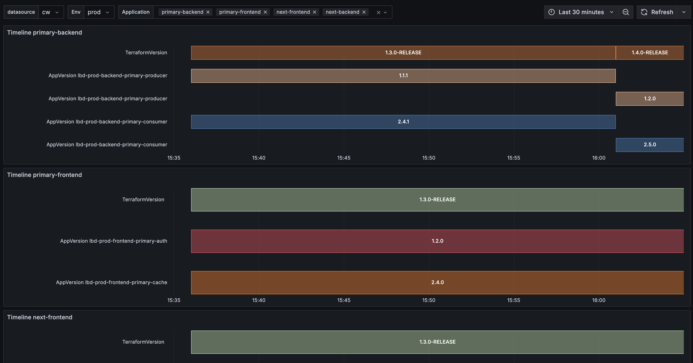

# Observability Projects

This repository contains various observability projects for AWS infrastructure monitoring and management. Each project is designed to enhance visibility, security, and operational efficiency of your AWS infrastructure.

## Projects Overview

### 1. AWS Lambda Inspector

The AWS Lambda Inspector is a comprehensive monitoring solution that automatically tracks and reports on your AWS Lambda functions across different environments. It provides visibility into your Lambda function versions, deployment states, and helps maintain consistency across your development and production environments.

To ensure comprehensive version tracking, it's essential to monitor both the Infrastructure as Code (IAC) version and the Application version. The IAC version captures infrastructure-related changes such as environment variables, IAM permissions, and other AWS resource configurations, while the Application version tracks the actual code and package changes.

#### Key Features
- **Automated Version Tracking**: Monitors Lambda function versions across different environments (dev, prod)
- **Environment Comparison**: Easily compare versions between development and production environments
- **Service-Level Monitoring**: Track versions at the service and stack level
- **CloudWatch Integration**: Publishes custom metrics for better observability
- **Terraform Integration**: Seamlessly works with your existing Terraform infrastructure
- **Grafana Dashboard**: Visual monitoring and alerting capabilities
- **Scheduled Monitoring**: Configurable monitoring intervals (default: 5 minutes)

#### Preview

*Grafana dashboard showing Lambda function versions across environments*

For more details, see the [AWS Lambda Inspector README](AWSLambdaInspector/README.md)

### 2. AWS Trusted Advisor

AWS Trusted Advisor provides real-time guidance to help provision your resources following AWS best practices. This project integrates Trusted Advisor checks with Grafana for enhanced visibility and monitoring.

#### Prerequisites
To use AWS Trusted Advisor, you must have an AWS Support plan. The minimum required plan is the **Developer Support** tier. You can manage your support plan at:
- [AWS Support Plans Console](https://us-east-1.console.aws.amazon.com/support/plans/home?region=us-east-1#/)

#### Key Features
- **Real-time Monitoring**: Track AWS Trusted Advisor checks in real-time
- **Custom Metrics**: Convert Trusted Advisor checks into CloudWatch metrics
- **Grafana Integration**: Visualize check results and trends
- **Alerting**: Configure alerts for critical checks
- **Historical Analysis**: Track check results over time

#### Preview

*Grafana dashboard showing checks done by AWS Trusted Advisor*

For more details, see the [AWS Trusted Advisor README](AWSTrustedAdvisor/README.md)

### 3. Grafana CloudWatch Key Rotator

The Grafana CloudWatch Key Rotator is a security and maintenance solution that automatically rotates IAM access keys used by Grafana to access CloudWatch metrics, ensuring your AWS monitoring infrastructure follows security best practices.

#### Key Features
- **Automated Key Rotation**: Automatically rotates IAM access keys on a configurable schedule
- **Grafana Integration**: Seamlessly updates Grafana data source credentials
- **CloudWatch Monitoring**: Tracks key age and rotation events
- **Terraform Implementation**: Easily deployed and managed with Terraform
- **Secure Key Management**: Uses AWS Secrets Manager and KMS for secure key storage
- **Zero-Downtime Rotation**: Maintains continuous Grafana monitoring during rotation

For more details, see the [Grafana CloudWatch Key Rotator README](GrafanaCloudWatchKeyRotator/README.md)

## Getting Started

Each project in this repository has its own documentation and setup instructions. Please refer to the individual project READMEs for detailed information.

### Prerequisites
- AWS Account with appropriate permissions
- Terraform (>= 1.0.11)
- AWS CLI configured
- Grafana instance (self-hosted or cloud)
- AWS Support Plan (Developer tier or higher) for Trusted Advisor

### Installation
1. Clone the repository:
   ```bash
   git clone <repository-url>
   cd observability
   ```

2. Navigate to the desired project directory:
   ```bash
   cd <project-name>
   ```

3. Follow the specific installation instructions in the project's README

## Contributing

Contributions are welcome! Please follow these steps:
1. Fork the repository
2. Create a feature branch
3. Commit your changes
4. Push to the branch
5. Create a Pull Request

## License

This project is licensed under the MIT License - see the [LICENSE](LICENSE) file for details.

## Support

For support, please:
1. Check the existing documentation
2. Review the project-specific READMEs
3. Open an issue in the repository

## Additional Resources

- [AWS Documentation](https://docs.aws.amazon.com/)
- [Terraform Documentation](https://www.terraform.io/docs/index.html)
- [Grafana Documentation](https://grafana.com/docs/)
- [CloudWatch Documentation](https://docs.aws.amazon.com/cloudwatch/)
